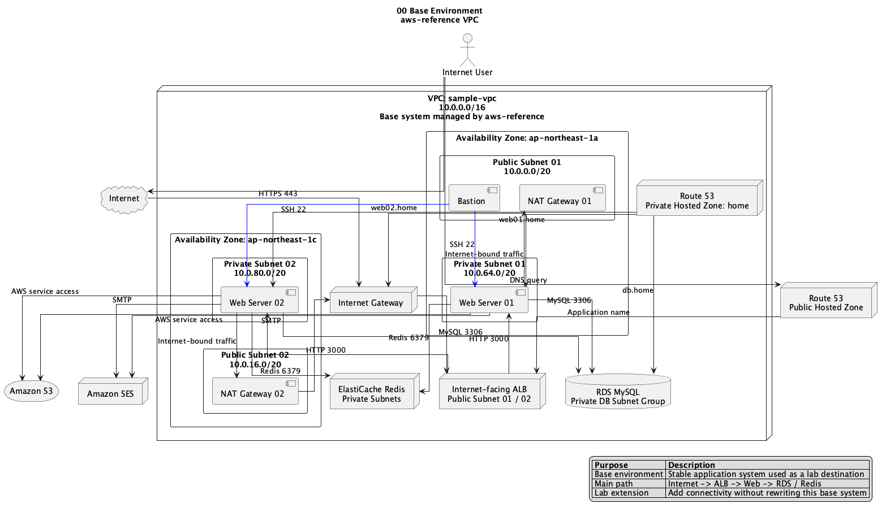
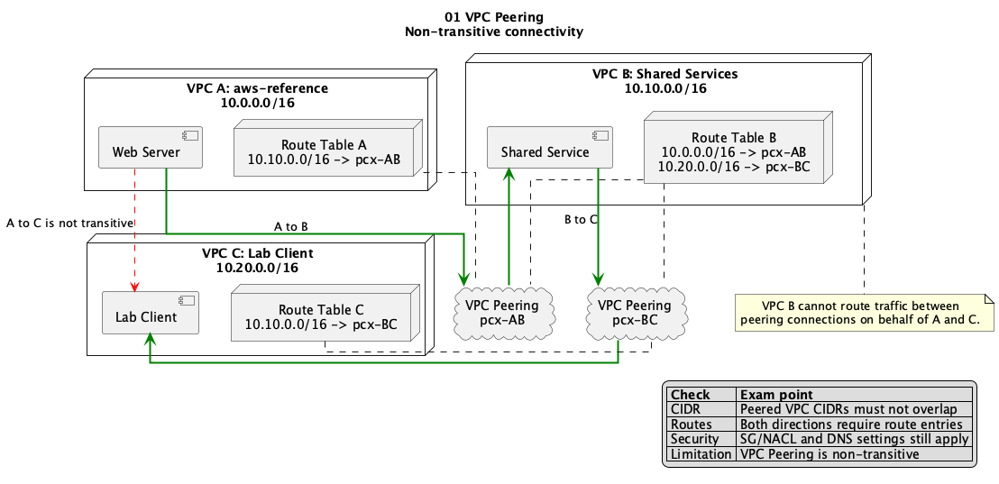
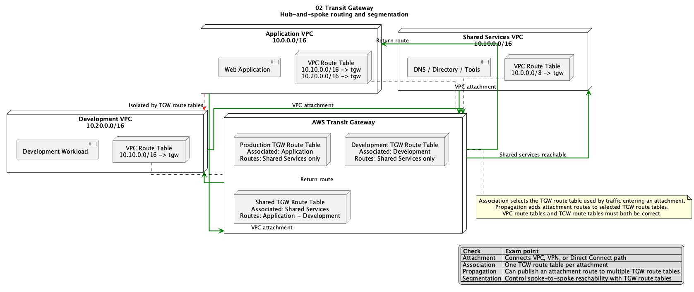
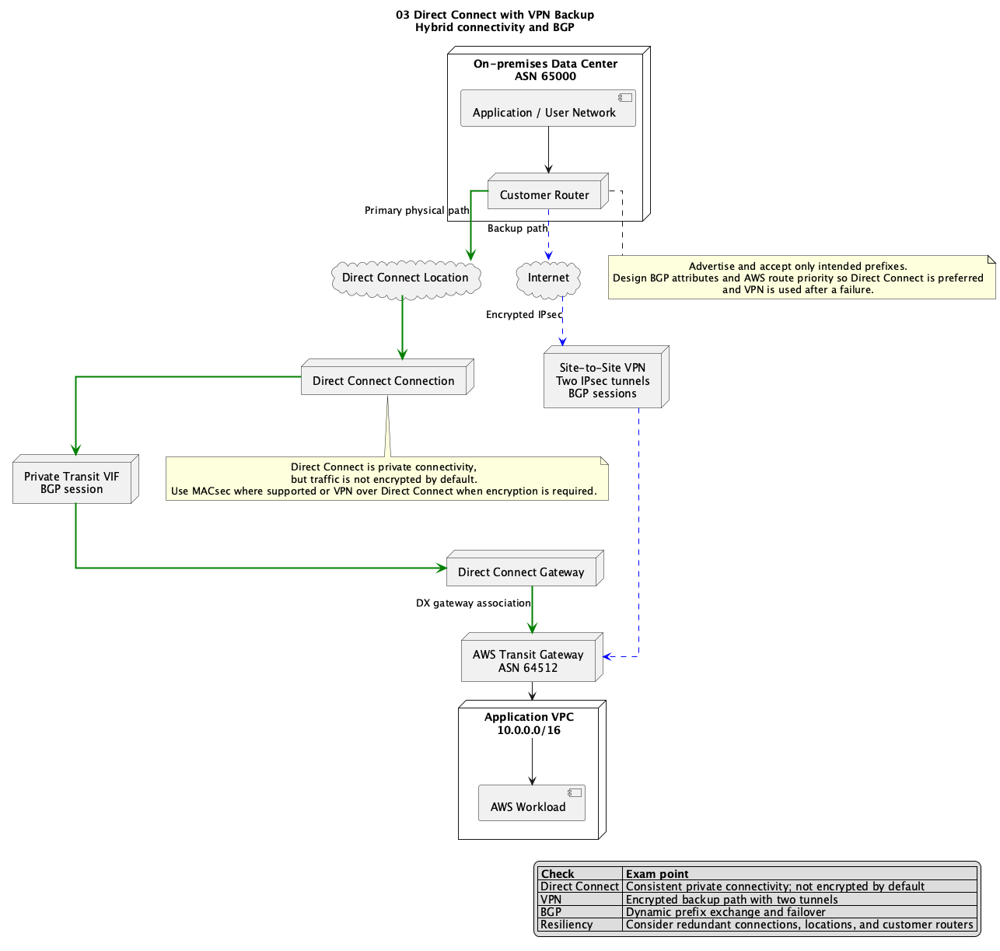
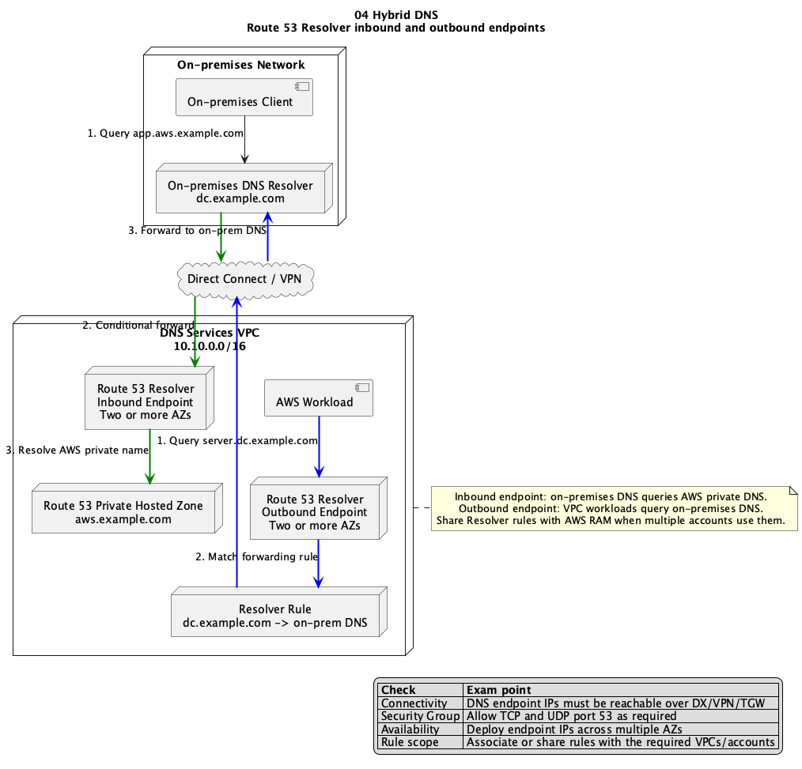
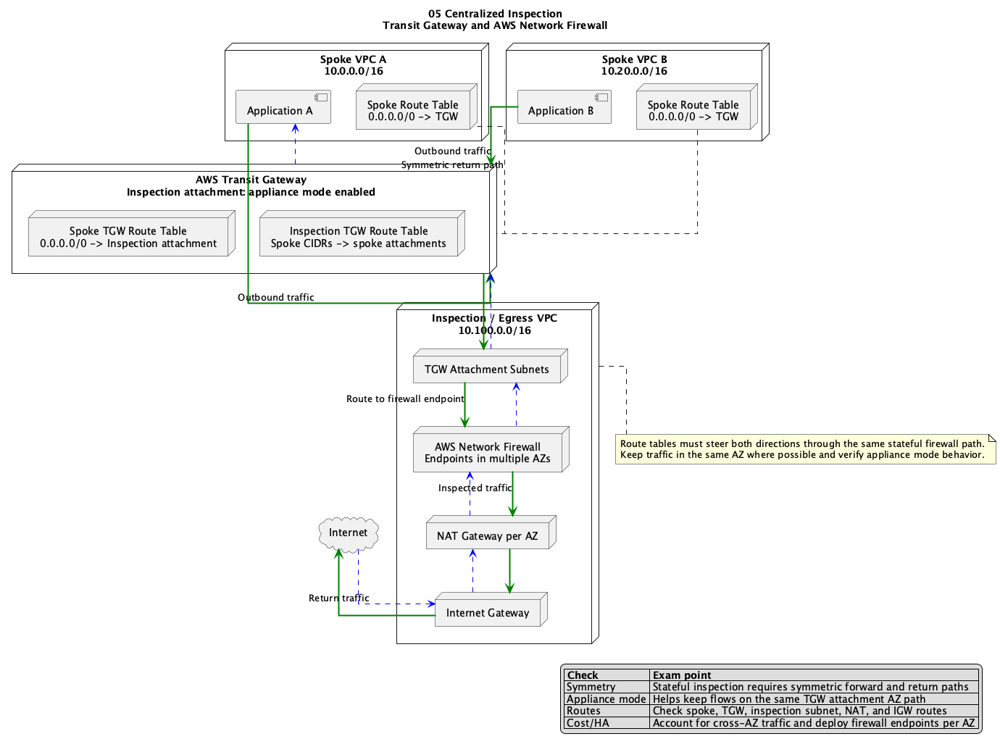
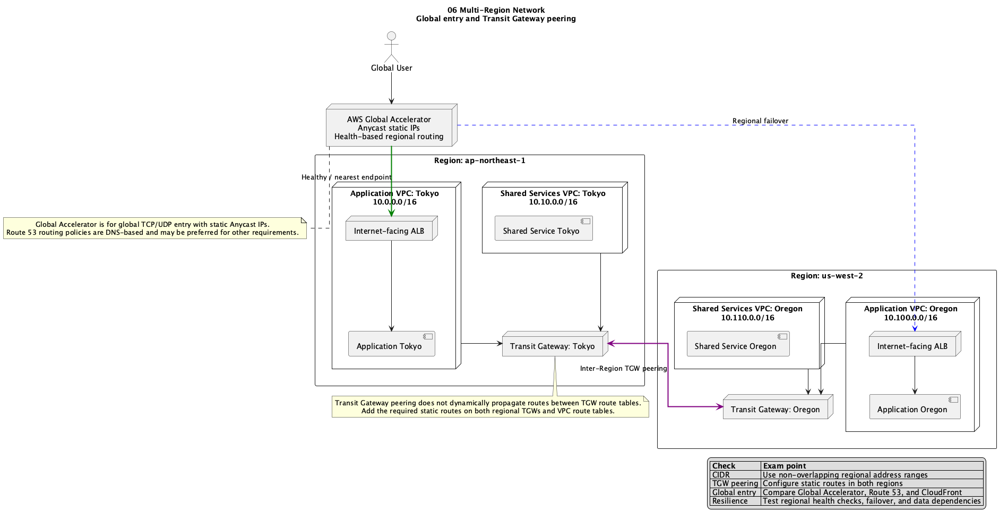

# Diagrams

ネットワーク構成図と通信経路図を配置する。

## 構成図一覧

| No. | 構成図 | ソース | 主な学習ポイント |
| :--- | :--- | :--- | :--- |
| 00 | [Base Environment PNG](./00_base_environment.png) | [PlantUML](./00_base_environment.puml) | `aws-reference` VPCの基本通信経路 |
| 01 | [VPC Peering PNG](./01_vpc_peering.png) | [PlantUML](./01_vpc_peering.puml) | 双方向Route、CIDR重複、非推移性 |
| 02 | [Transit Gateway PNG](./02_transit_gateway.png) | [PlantUML](./02_transit_gateway.puml) | Attachment、Association、Propagation、分離 |
| 03 | [Direct Connect with VPN Backup PNG](./03_direct_connect_vpn_backup.png) | [PlantUML](./03_direct_connect_vpn_backup.puml) | BGP、冗長化、暗号化、バックアップ経路 |
| 04 | [Hybrid DNS PNG](./04_hybrid_dns.png) | [PlantUML](./04_hybrid_dns.puml) | Resolver Inbound/Outbound Endpoint、転送Rule |
| 05 | [Centralized Inspection PNG](./05_centralized_inspection.png) | [PlantUML](./05_centralized_inspection.puml) | Network Firewall、対称ルーティング、Appliance Mode |
| 06 | [Multi-Region PNG](./06_multi_region.png) | [PlantUML](./06_multi_region.puml) | TGW Peering、Global Accelerator、リージョン障害対策 |

## プレビュー

### 00 Base Environment

### 01 VPC Peering

### 02 Transit Gateway

### 03 Direct Connect with VPN Backup

### 04 Hybrid DNS

### 05 Centralized Inspection

### 06 Multi-Region

## 図の読み方

- 緑の実線は、主経路または正常時の転送を示す
- 青の破線は、バックアップ経路または戻り通信を示す
- 赤の破線は、到達できない経路または分離された経路を示す
- 各図のRoute Table、CIDR、通信方向、戻り経路を説明できるようにする

## 更新方針

- 実際に構築するラボと対応させる
- ラボの設計変更時は構成図も更新する
- CIDR、Route Table、Attachment、通信Portなど、経路判断に必要な情報を記載する
- 本番設計では要件、クォータ、可用性、セキュリティ、コストを別途確認する
